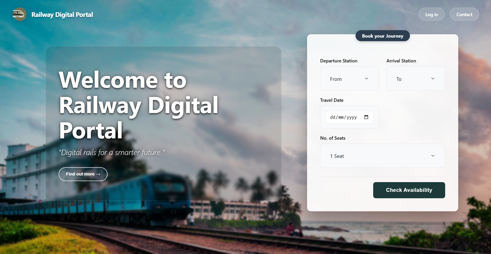
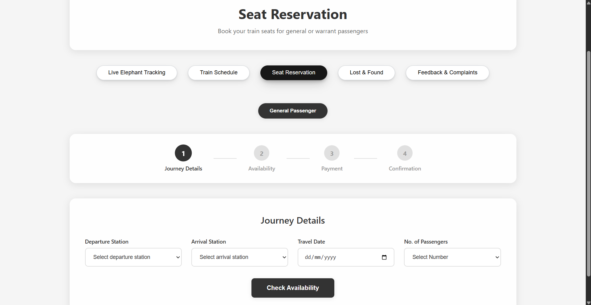

# Smart Railway Tracking System

A full-stack railway management and digital portal system developed as a Software Engineering project at KDU. The system provides real-time train tracking, seat reservations, lost & found management, and a feedback system for both passengers and train administrators.

---

##  Tech Stack

| Layer       | Technology                                      |
|-------------|------------------------------------------------|
| **Frontend**  | React 19, React Router v7, Axios             |
| **Backend**   | Spring Boot 3.5.5, Spring Security, Spring Data JPA |
| **Database**  | PostgreSQL                                    |
| **Email**     | Gmail SMTP (OTP-based verification)           |
| **Maps**      | Google Maps API (Live Elephant Tracking)      |
| **Build Tool**| Maven                                         |

---

##  Features

###  Passenger Portal
-  **User Authentication** — Register & login with OTP email verification
-  **Live Elephant Tracking Map** — Real-time map showing elephant locations along railway routes
-  **Train Schedule** — View train schedules with departure/arrival times and routes
-  **Seat Reservation** — Reserve seats with class selection and availability checking
-  **Payment Processing** — Secure ticket payment system
-  **Lost & Found** — Report lost items and browse found items with image uploads
-  **Feedback & Complaints** — Submit feedback with star ratings and file complaints
-  **User Profile** — View and manage personal account information

### 🛡️ Train Master (Admin) Portal
-  **Schedule Management** — Create, edit, and manage train schedules
-  **Price Management** — Set and update ticket prices per route and class
-  **Feedback & Complaint Management** — View passenger feedback and reply to complaints
-  **Live Elephant Tracking** — Monitor elephant activity near rail routes

---

##  Project Structure

```
tracking/
├── src/main/java/com/train/project/tracking/
│   ├── controller/        # REST API endpoints
│   ├── model/             # JPA entity classes
│   ├── repository/        # Database repositories
│   ├── service/           # Business logic services
│   ├── dto/               # Data transfer objects
│   └── jobs/              # Scheduled background tasks
├── src/main/resources/
│   └── application.properties   # App configuration
├── frontend/
│   ├── public/            # Static assets & images
│   └── src/
│       └── pages/         # React page components
├── uploads/               # User-uploaded files (lost & found images)
└── pom.xml                # Maven dependencies
```

---

##  How to Run

### Prerequisites
- **Java 24** (JDK)
- **Node.js** (v18+)
- **PostgreSQL**
- **Maven** (or use included `mvnw` wrapper)

### 1️ Database Setup
```sql
CREATE DATABASE railway_auth;
```

### 2️ Backend (Spring Boot)
```bash
# Set environment variables
$env:DB_PASSWORD="your_postgres_password"
$env:SPRING_MAIL_PASSWORD="your_gmail_app_password"

# Run the backend
mvn spring-boot:run -DskipTests
```
Backend starts at: **http://localhost:8080**

### 3️ Frontend (React)
```bash
cd frontend
npm install
npm start
```
Frontend starts at: **http://localhost:3000**

---

##  Environment Variables

| Variable              | Description                          |
|-----------------------|--------------------------------------|
| `DB_PASSWORD`         | PostgreSQL database password         |
| `SPRING_MAIL_PASSWORD`| Gmail App Password for OTP emails    |

---

##  Screenshots





---

##  Contributors

| Name                   | Role                    |
|------------------------|-------------------------|
| DR Warnasooriya        | Project Manager         |
| SGT Tharumila          | QA & Testing Engineer   |
| AL Ranidu Lakshan      | Backend Developer       |
| PYB Karunasena         | Frontend Developer      |
| MKF Gulzar Dhinany     | Business Analyst        |

---

##  License

This project was developed as part of the Software Engineering course at **KDU (General Sir John Kotelawala Defence University)**.
